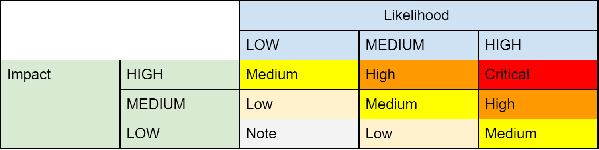

# [HUH.social](https://huh.social)

## Bug Bounty Campaign

#
# RULES & REWARDS
Dear white hat hacker, please consider the following points before your [HUH.social](https://huh.social/) bug research! If you are willing to wear a red hat, this program does not apply to you.

## Eligibility
- Already submitted issues by another user or that are already known to the HUH team are not eligible for bounty rewards.
- A publicly disclosed vulnerability is ineligible for a bounty.
- The rewards are only eligible for outsiders. HUH’s dev team members, employees and all other people paid by the HUH project and parent entities, regardless if indirectly or not, are not eligible for rewards.
- Determination of eligibility is at the sole and final discretion of the HUH bug bounty panel and can be changed with a 3 months prior notice.
## Scope
- You can freely explore different attack vectors as long as there are no major drawbacks for the HUH ecosystem.
- HUH websites or infrastructure in general, are not part of the bounty program.
## Rewards
- HUH bounty program considers a number of variables in determining rewards. Score and all terms related to an award are at the sole and final discretion of the HUH bug bounty panel.
- The value of rewards paid out vary depending on severity. The severity is calculated according to the [OWASP](https://en.wikipedia.org/wiki/OWASP) risk rating model based on likelihood and impact:

- Reward sizes are guided by the rules below, but are in the end, determined at the sole discretion of the HUH bug bounty panel.
  - Critical: up to 50,000 points
  - High: up to 3,000 points
  - Medium: up to 2,000 points
  - Low: up to 400 points
  - Note: up to 100 points

- 1 point currently corresponds to 1 USD (payable in crypto), something which may change with a 3 months prior notice.

# Leaderboard ranking

Every bounty is also eligible for listing on our leaderboard with points accumulating over the course of the program beyond monetary rewards.

Other than severity variables are also considered when the HUH bounty panel decides the score, including but not limited to:

- Quality of description. Higher rewards are paid for clear, well-written submissions.
- Quality of reproducibility. Please include test code, scripts and detailed instructions. The easier it is for us to reproduce and verify the vulnerability, the higher the reward. Please see the wiki and repos to learn more about our test suite in the official documentation.
- Quality of fix, if included. Higher rewards are paid for submissions with clear descriptions of how to fix the issue.

#
# FAQ

1. ## What should a good vulnerability submission look like?

Here is an example of a real issue which was previously identified in a similar project

Description: The enhancer stage can become out of sync with the campaign in method notate

Attack Scenario: The enhancer becomes out of sync, and a contribution can be made past the funding cap. Thus causing unwanted contribution.

Components: contracts/src/contracts/AContract.sol and contracts/src/contracts/AnotherContract.sol

Reproduction: Deploy campaign contracts in 'xyz' environment. Contribute to the point of the funding cap. Then log around the funding cap to reproduce.

Details: Any other details not covered. Can also contain links to GitHub Gists, repos containing code samples, etc.

Fix: Remove 'stage()' modifier from 'notate' method.

2. ## Is the bug bounty program time limited?

There is no limit so far. A delimitation might be stipulated with a 3 months notice period.

3. ## How are bounties paid out?

Rewards are paid out in cryptocurrencies after the submission has been validated. Local laws may require us to ask for proof of your identity. In addition, we will need your wallet address.

4. ## I reported an issue / vulnerability but have not received a response

We review and respond to submissions as fast as possible. Please email us [bounty at huh.social](mailto:bounty@huh.social) if you have not received a response within three business days.

5. ## I want to be anonymous

Submitting anonymously is fine, but may make you ineligible for rewards. To be eligible, we may require your real name and basic identifying information as necessary to comply with the law. Unless you can show a credible legal opinion that clearly shows a risk free process to anonymously reward you, you will receive no monetary reward.

6. ## What does Recognition mean?

Every bounty hunter who found a vulnerability or issue is eligible to be listed on our website.

7. ## I have further questions

Email us at [bounty at huh.social](mailto:bounty@huh.social)

# Important Legal Information

The bug bounty program is a rewards program for the HUH community to encourage and reward those who are helping to improve the ecosystem in any possible way. The awards are at the sole discretion of the HUH bug bounty panel. HUH is not able to issue awards to individuals who are on or are in countries on the UK sanctions lists. All awards are subject to applicable law.

# References
1. Bounty.ethereum.org. 2021. *Ethereum Bounty Program*. [online] Available at: <<https://bounty.ethereum.org/>> [Accessed 15 November 2021].
2. GitHub. 2021. *weifund-contracts/BUG-BOUNTY-DETAILS.md at master · weifund/weifund-contracts*. [online] Available at: <https://github.com/weifund/weifund-contracts/blob/master/BUG-BOUNTY-DETAILS.md> [Accessed 15 November 2021].

